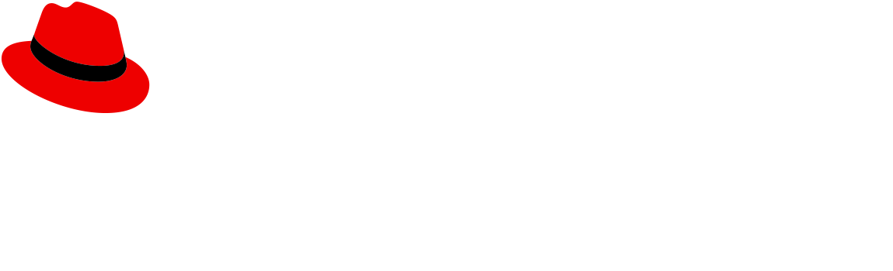
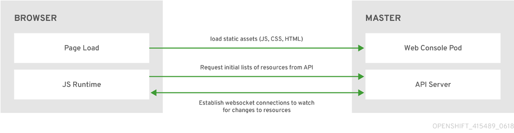

---
# try also 'default' to start simple
theme: seriph
themeConfig:
  primary: '#ee0000'
# random image from a curated Unsplash collection by Anthony
# like them? see https://unsplash.com/collections/94734566/slidev
background: images/openshift.svg
# some information about your slides, markdown enabled
title: Red Hat OpenShift
info: |
  ## Slidev Starter Template
  Presentation slides for developers.

  Learn more at [Sli.dev](https://sli.dev)
# apply any unocss classes to the current slide
class: text-center
# https://sli.dev/custom/highlighters.html
highlighter: shiki
# https://sli.dev/guide/drawing
drawings:
  persist: false
# slide transition: https://sli.dev/guide/animations#slide-transitions
transition: slide-left
# enable MDC Syntax: https://sli.dev/guide/syntax#mdc-syntax
mdc: true
hideInToc: true

---

# Red Hat OpenShift

Introduction & Demo of OpenShift

<!--
The last comment block of each slide will be treated as slide notes. It will be visible and editable in Presenter Mode along with the slide. [Read more in the docs](https://sli.dev/guide/syntax.html#notes)
-->

---
layout: two-cols
layoutClass: gap-16
hideInToc: true
---

# Table of contents

<Toc minDepth="1" maxDepth="1"></Toc>

---
transition: slide-up
level: 1
layout: section
---
# About Red Hat & OpenShift

---
transition: slide-up
level: 2
layout: image-right
image: https://upload.wikimedia.org/wikipedia/commons/d/d8/Red_Hat_logo.svg 
backgroundSize: 15vw
---

## What is Red Hat

- Leading provider of different open-source solutions for enterprises

- Portfolio also includes middleware, storage, virtualization, and cloud technologies, catering to various enterprise needs.

- It follows an open-source business model, providing access to its source code and collaborating with the community to develop and enhance its products.

- In 2019, Red Hat was acquired by IBM, but it continues to operate as a separate entity within the IBM Cloud and Cognitive Software division.

---
transition: slide-up
level: 2
color: white
# layout: three-cols

---

## Notable Red Hat Products

- open-source automation tool

- simplifies complex tasks by allowing users to automate repetitive tasks such as software provisioning or application deployment across multiple servers or devices.

- uses a simple and human-readable syntax (YAML) and operates agentlessly, communicating with remote nodes via SSH

- Commercial open-source Linux distribution

- stable and secure operating system platform with long-term support, suitable for mission-critical applications and infrastructure.

- Fedora Linux and CentOS Stream as upstream sources

- highly available and scalable container image registry solution designed for enterprises 

- offers advanced features such as role-based access control (RBAC), image scanning for vulnerabilities and compliance, content signing, and replication

---
level: 2
layout: image-left
image: images/openshift-named.svg
backgroundSize: 15vw
---

## What is Red Hat OpenShift?

 
 

- Hybrid cloud application platform

- Built around Linux containers

- Orchestrated and managed by Kubernetes (RHOS builds upon Kubernetes but adds enterprise features and support, including additional tools and services)

- foundation of Red Hat Enterprise Linux (RHEL)

---
level: 2
---

## Red Hat OpenShift vs. Kubernetes

|                                        | Kubernetes | OpenShift |
|----------------------------------------|------------|-----------|
| Multi-container, multi-host scheduling | ✅          | ✅         |
| Self-service provisioning              | ✅          | ✅         |
| Service discovery                      | ✅          | ✅         |
| Persistent Storage                     | ✅          | ✅         |
| Multi-tenancy                          | ❌          | ✅         |
| Networking (SDN)                       | ❌          | ✅         |
| Image Registry                         | ❌          | ✅         |

---
level: 2
hideInToc: true
---

## Red Hat OpenShift vs. Kubernetes

|                                        | Kubernetes | OpenShift |
|----------------------------------------|------------|-----------|
| Image Build Tools                      |  ❌        | ✅         |
| Metrics                                |  ❌        | ✅         |
| Log Aggregation                        |  ❌        | ✅         |
| Ingress                                |  ❌        | ✅         |
| UX: Console, Service Catalog, "oc"     |  ❌        | ✅         |
| Secured by Default                     |  ❌        | ✅         |

---
level: 2
---

## OpenShift Deployments

OpenShift can be deployed in the cloud, on-premise or hybrid. 

- Red Hat OpenShift Container Platform (self-managed instance in the cloud or on-premise)

- Red Hat OpenShift on AWS (ROSA)

- Azure Red Hat OpenShift (ARO)

- Red Hat OpenShift Container Platform on GCP

- Red Hat OpenShift on IBM Cloud 

---
level: 1
layout: section
---

# OpenShift Architecture & Concepts

---
level: 2
---

# OpenShift Architecture

- Layered system designed to expose underlying Docker-formatted container image and Kubernetes concepts as accurately as possible
- Focus on easy composition of applications by a developer

Layers:

  - Docker service provides abstraction for packaging and creating container images
  - Kubernetes provides the cluster management and multi-host container orchestration
  - OpenShift Container Platform adds:
    - Source code management, builds, and deployments for developers
    - Managing and promoting images at scale
    - Application management at scale
    - Team and user tracking 
    - Networking infrastructure

---
level: 2
layout: image
image: images/architecture.png
backgroundSize: 80%
---

## OpenShift Architecture

---
level: 2
hide: true
---

# How OpenShift works

- Microservices-based architecture of smaller, decoupled units that work together
  - `etcd` – a clustered key-value store holding data about the objects 
  - REST APIs, exposing each of the core objects
  - Controllers reading those APIs and applying changes to other objects, and report status or write back to to the object

- Controller pattern means that much of the functionality is extensible
- Controllers leverage a reliable stream of changes to the system to sync their view of the system with what users are doing

---
level: 2
---

## OpenShift Resources

### Project

Comparable to Kubernetes Namespace, but with additional administrative controls:

- **Isolation**: Provide a level of isolation and resource management within an OpenShift cluster (sandboxed environment)

- Fine grained **control over permissions**: Own set of access controls and security policies

- **Quotas and limits**: Administrators can set limits on the amount of CPU, memory, storage and other resources that each project can consume

- **Multi-Tenancy support**: organizations can host multiple teams or applications within the same cluster while maintaining isolation and security between them

---
level: 2
---
## OpenShift Resources

### Container Registry (OCR) / Quay

- Integrated registry that provides a secure and centralized location for storing and managing container images

- facilitates image promotion and lifecycle management by enabling users to tag, version, and promote container images across different environments 

- seamlessly integrates with OpenShift Pipelines, allowing users to automate the build, test, and deployment processes for containerized applications. It provides native support for source-to-image (S2I) builds, Dockerfile builds, and image streams, enabling continuous integration and delivery (CI/CD) workflows.

- Quay is a standalone enterprise-grade CR

---
level: 2
---
## OpenShift Web Console

- Feature-rich GUI to control the OpenShift instance itself as well as workloads and resources running on OpenShift

- Runs itself as a pod on the master node

---
level: 2
---
## OpenShift CLI

`oc`: CLI tool to manage OpenShift Container Platform projects and other resources from a terminal

Examples: 

- `oc cluster-info`
- `oc get projects`
- `oc login <OpenShift API URL> -u <username> -p <password>`
- `oc new-project <project-name>`
- `oc new-app <image-name>`

---
level: 2
---
## OpenShift Core Concepts

Based on Kubernets, extended by OpenShift to provide a more feature-rich development lifecycle platform

- Containers & images &nbsp;&nbsp;➡️ &nbsp;&nbsp;  building blocks for deploying applications
- Pods & services &nbsp;&nbsp; ➡️  &nbsp;&nbsp; inter-container communication
- Projects & users &nbsp;&nbsp; ➡️ &nbsp;&nbsp; organization & separation of users & workloads
- Builds & image streams &nbsp;&nbsp; ➡️ &nbsp;&nbsp;  image building with event stream
- Deployments &nbsp;&nbsp; ➡️ &nbsp;&nbsp; expanded support for software development and deployment lifecycle
- Routes &nbsp;&nbsp; ➡️ &nbsp;&nbsp; service accessibility
- Templates &nbsp;&nbsp; ➡️ &nbsp;&nbsp; multi-object creation based on customized parameters

---
level: 3
---
## OpenShift Core Concepts - Builds

A build is the process of transforming input parameters or source code into a result object (runnable image). A `BuildConfig` object is the definition of the entire build process.

OpenShift offers 3 different build strategies:

- **Docker build**: Expects a repository with a Dockerfile and all required artifacts to produce a Docker image
- **S2I build**: Source-to-Image build is a tool for building Docker-formatted container images by injecting application source into a container image and assembling a new image
- **Custom build**: allows developers to define a specific builder image responsible for the whole process. The resulting objects are whatever the builder image author has specified

---
level: 3
---
## OpenShift Core Concepts - Deployments

- **Deployment**
  - Native Kubernetes object
  - A deployment is an object type used to manage the rollout and scaling of application replicas (pods) in the cluster
  - Defines the desired state for the application, automatically creating or updating pods as needed to match the desired configuration
  - Supports various strategies, such as rolling updates, blue-green deployments, and canary deployments

- **DeploymentConfig**
  - OpenShift specific resource
  - Provides additional features and capabilities tailored for managing applications within OS
  - e.g. can trigger new deployments with `ConfigChange` or `ImageChange` 

---
level: 1
layout: section
---
# Demo 1

## Deploy full stack application in OpenShift

---
level: 1
layout: section
---
# Red Hat OpenShift AI

---
level: 2
---
# What is Red Hat OpenShift AI?

- flexible, scalable AI and ML platform that enables enterprises to create and deliver AI-enabled applications at scale across hybrid cloud environments.

- Helps data scientists and developers to collaborate and move from experiment to production in a consistent environment quickly (**MLOps**)

- Integrates familiar tools and libraries like Jupyter, TensorFlow, and PyTorch along with MLOps components for model serving and data science pipelines into a flexible UI

---
level: 2
layout: image
image: images/mlops.png
backgroundSize: 80%
---
# Red Hat OpenShift AI & MLOps

---
level: 2
layout: image
image: images/mlops-example.png
backgroundSize: 75%
---
# Red Hat OpenShift AI - Example Architecture

---
level: 1
layout: section
---
# Demo 2

## Deploy training & model serving project

---

# Sources

- https://www.openvirtualization.pro/red-hat-openshift-container-platform/
- https://redhat-scholars.github.io/openshift-starter-guides/rhs-openshift-starter-guides/4.11/index.html
- https://access.redhat.com/documentation/en-us/red_hat_openshift_ai_self-managed/2-latest/html/getting_started_with_red_hat_openshift_ai_self-managed/index
- https://www.redhat.com/de/technologies/management/ansible
- https://developers.redhat.com/developer-sandbox
- https://access.redhat.com/documentation/en-us/builds_for_red_hat_openshift/1.0
---
layout: center
class: text-center
---

# Questions

## Thanks for listening
